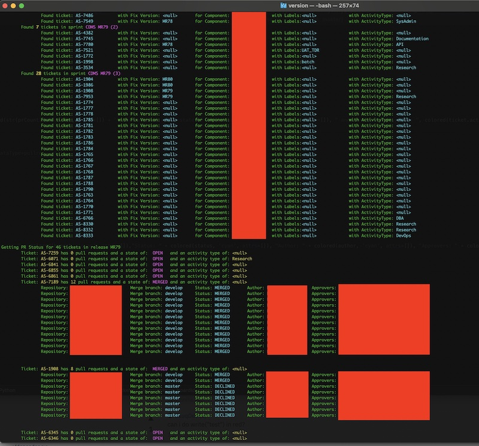

<h1 align="center">JIRA</h1>

### Description:
This is a collection of python scripts built against JIRA for performing random work to make my life easier. There is no method to this collection and is ultimately random scripts to produce output that was useful for something I needed at some point in time.

###Files:
* validateRelease - This script was used in an Agile environment to validate features per sprint going into an upcoming release.

###Validate Release
The intention of the script is to provide two unique, but similar services. One service is to run a basic release report which highlights what Jira Sprint Boards are included in the release, as well as what tickets were in each sprint- and the Pull Request (PR) status of each ticket. The script was run in an environment that had the BitBucket integration implemented in Jira. The idea is that if the ticket is included in the sprint and yet the ticket has not had a PR to the develop branch, then red flags should be raised since the ticket has not officially been completed. Note that this works on the assumption that the team is using GitFlow and committing their code to a "develop" like branch when ready for a release candidate build. It's arguable that this summary may not be particularly useful as most of this information is already available on the "Sprint Report" Jira report. That said, the Jira report doesn't take into account the PR status, so there's definitely some value-add for the script.

The second service of the script- and arguably the more useful service- is the creation of a "Release Branch Creation Report." This report creates an association view of "tickets by repository" such that a single repository has a list of all Jira tickets that have had code PR'ed to develop (and thus ready for release). Again this service implies that they team is using GitFlow and committing to a "develop" like branch. This report can be exceptionally useful in discovering what repositories need to have a release branch created for a specific release.

Unfortunately, one negative about Jira is that it's a "living" application meaning that historical reporting doesn't seem to work well from an API perspective. If a ticket was added to a sprint titled "MR78-1" and the ticket has rolled through four more sprints into "MR79-2" then sometimes Jira will not report that the ticket is part of the MR78 sprints. In this case that's probably ok because the code was assumed finished in the MR79 release. The point though is that Jira is weird, and the reporting is sometimes questionable. As such, sad as it is to say, the reports should be taken as a very good starting point, and some product management manual validation would be a good idea. Additionally, the script is only as good as the intended logic. The intended logic is to assume that the work completed in the three-sprint series is the *exclusive list* of all working going into the release. Therefore if someone decided to randomly work a newer (or older) ticket that was never in the three sprints and commit code to the develop branch- the script would not identify that Jira ticket as being part of the release because the ticket was never in the sprint. This is a perfect case of "if you would just follow the process we wouldn't be in this mess."

####Execution
The script is a python script and can be run from the command line in a typical python way:

```bash
  $ python validateRelease.py
```

 When running the script with no parameters, it is assumed that parameters will be provided at run time on the console:
```
$ python validateRelease.py
Enter jira username: wdemis
Enter jira password:
Enter jira board name: CDMS Dev Board
Enter release number: 79
Generate release branch creation report (y/n): n
*****************************Validating Release MR79*****************************
```

The script also supports command line parameters with the intention of being injected into a larger control-logic script. When command line parameters are used, all parameters must be specified:
```
$ python validateRelease.py -h
        validateRelease.py -u <username> -p <password> -b <board> -n <releasenum> -r <releasereport>
```
			
For example:
```
$ python validateRelease.py -u wdemis -p <redacted> -b 'CDMS Dev Board' -n 79 - r n
	
*****************************Validating Release MR79*****************************
```

In a larger control-logic script, stdout would be piped to an email body and the script output emailed to targeted owners of specific Jira boards.

####Reference Executions
Example output from the Release Overview Report:<cr>


Example output from the Release Branch Creation Report:<cr>
	