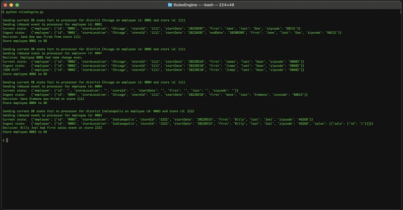

<h1 align="center">Durable Rules Engine POC</h1>

### Description:
This is a basic POC using the durable\_rules engine found [here](https://github.com/jruizgit/rules/blob/master/docs/py/reference.md). This set of three python scripts are used to demonstrate the idea of getting source data from some location (particularly a database) and comparing it to a change data stream being ingested into the system. The rules engine would determine what, if any, rules should be applied to the change data as it enters. The mock data in the POC represents a very basic employee registry (with a rather ludicris conflation of sales data because I couldn't think of any other rules to apply). The rules engine operates on two rulesets that each represent a "district" for business locations. The idea of having two rulesets is there simply to show that rules can be broken down into unique rulesets that are uniquely applied based on input data. The rules could be anything, but in this POC the rules are as follows:

For the **Chicago RuleSet**:
* Employee hired event
* Employee fired event
* Employee name changed event

For the **Indianapolis RuleSet**:
* Employee first sales event

### Files:
The POC is comprised of three python program files. 
* currentStateDataProvider - This file simply acts as a stand in for a database and ORM provider. It is here to represent the "known" state of employee records at any given time.
* inboundDataProvider - This file simply acts as a stand in for an inbound data event for ingestion. It is here to represent the "changed" state of a set of employee records feed to "the system."
* rulesEngine - This is ultimately the actual POC and highlights a basic usage of the durable\_rules engine. 

### Execution
Execution of the rulesEngine script will produce this output:

